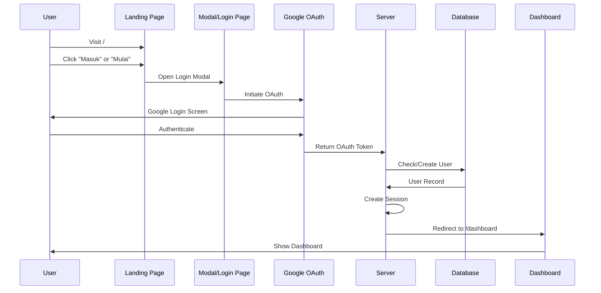
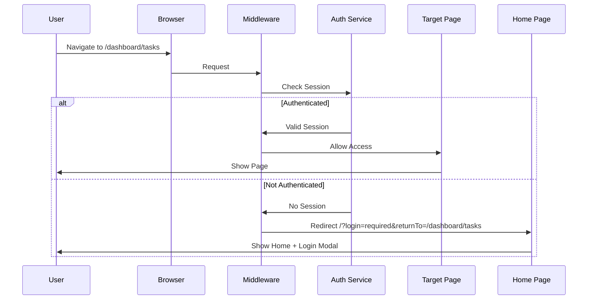
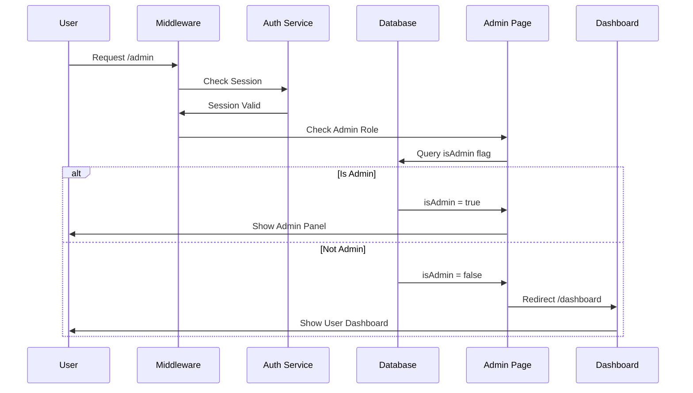

# GengoBot - Sitemap & User Flow Documentation

## 📋 Daftar Isi

- [Struktur User States](#struktur-user-states)
- [Arsitektur Aplikasi](#arsitektur-aplikasi)
- [Sitemap Lengkap](#sitemap-lengkap)
- [User Flow Diagrams](#user-flow-diagrams)
- [Authentication Flow](#authentication-flow)
- [Feature Routes](#feature-routes)

---

## 🔐 Struktur User States

### 1. **Guest User (Unauthenticated)**

- Status: Belum login
- Akses: Halaman publik saja
- Redirect: Ke home page dengan modal login jika mengakses protected routes

### 2. **Regular User (Authenticated)**

- Status: Login dengan Google OAuth
- Akses: Dashboard area, study features, chat, progress tracking
- Pembatasan: Tidak bisa akses admin panel

### 3. **Admin User**

- Status: Login dengan flag `isAdmin = true`
- Akses: Semua fitur regular user + admin panel
- Spesial: Manajemen users, tasks, decks, categories, characters, analytics

---

## 🏗️ Arsitektur Aplikasi

### Layout Hierarchy

```
Root Layout (src/app/layout.tsx)
├── Public Pages
│   ├── Home Page (/)
│   ├── Login Page (/login)
│   └── Auth Error (/auth/error)
│
├── Dashboard Layout (src/app/dashboard/layout.tsx)
│   └── Protected: Regular User & Admin
│
├── Admin Layout (src/app/admin/layout.tsx)
│   └── Protected: Admin Only
│
└── Study App Layout (src/app/(app)/layout.tsx)
    └── Study features with nested layout
```

### Authentication Middleware

**File:** `src/middleware.ts`

**Protected Routes:**

- `/dashboard/*` → Requires authentication
- `/admin/*` → Requires authentication + admin role
- **Redirect Logic:** Unauthenticated → `/?login=required&returnTo={pathname}`

---

## 🗺️ Sitemap Lengkap

### **Public Routes** (Accessible by All)

```
/                           → Home/Landing Page
├── Hero Section
├── Features Overview
├── Pricing Section
├── Testimonials
├── FAQ
└── CTA Section

/login                      → Standalone Login Page
└── Google OAuth Integration

/auth/error                 → Authentication Error Page
└── Error handling untuk auth failures

/termsofservice
└── terms of service

/privacypolicy
└── privacy policy

```

---

### **Dashboard Routes** (Authenticated Users)

```
/dashboard                  → Main Dashboard
├── Halo $username!
├── Menit latihan kaiwa
├── Kartu yang sudah hafal
├── Stats satu minggu
└── Recent Activity ()

/dashboard/kaiwa            → Latihan kaiwa
/kaiwa/bebas (Ngobrol bebas)
├── AI Character Selection (can create character here)
└── Message History

/kaiwa/Roleplay
├── Available Tasks
├── Task Filters (JLPT Level, Category)
└── → Start Task (with all pretask and feedback. its for menu understanding)

/dashboard/profile
settings         → User Settings
├── Profile Management
├── Preferences
└── Account Settings
/profile/progress         → Progress Tracking
├── Learning Statistics
├── Completed Tasks
├── Achievement Badges
└── Skill Assessment Charts
/profile/characters       → Character Management
├── Character List
├── → /new
│   └── Create New Character
└── → {id}/edit
    └── Edit Character Profile
```

/drill → Study Hub
├── Available Study Decks
/drill/my-decks → My Deck Collection
├── Personal Decks
├── Progress per Deck
└── Quick Study Actions
/drill/decks/new → Create New Deck
├── Deck Configuration
├── Card Templates
└── Initial Content Setup
/drill/decks/{deckId} → View Deck Details
├── Deck Overview
├── Card List
├── Study Statistics
└── → /study/decks/{deckId}/edit
├── Edit Deck Settings
├── Add/Remove Cards
└── Manage Vocabulary
/drill/{deckId} → Active Study Session
├── Flashcard Interface
├── Spaced Repetition Algorithm
├── Answer Grading (hafal/belum hafal)
└── Session Statistics

---

### **Admin Routes** (Admin Only)

```
/admin                      → Admin Dashboard
├── System Overview
├── Quick Actions
└── Recent Activity

/admin/analytics            → Analytics & Reports
├── User Metrics
├── Usage Statistics
├── Performance Data
├── Engagement Analytics
└── User Analytics (kaiwa practice time, card learned JLPT Level)

/admin/users                → User Management
├── User List
├── Search & Filter
├── Role Management
└── User Activity Logs

/admin/tasks                → Task Administration
├── Task List
├── → /admin/tasks/new
│   └── Create New Task
└── → /admin/tasks/{taskId}
    ├── Task Details
    └── → /admin/tasks/{taskId}/edit
        ├── Edit Task Content
        ├── Configure Difficulty
        └── Manage Vocabulary

/admin/decks                → Deck Management
├── All Decks Overview
├── → /admin/decks/new
│   └── Create System Deck
└── → /admin/decks/{deckId}
    ├── Deck Analytics
    └── → /admin/decks/{deckId}/edit
        ├── Edit Deck Content
        └── Manage Cards

/admin/categories           → Category Management
├── Category List
├── Create/Edit Categories
└── Hierarchy Organization

/admin/characters           → Character Administration
├── All AI Characters
├── Character Configuration
└── Behavior Settings

/admin/settings             → System Settings
├── Application Config
├── Feature Flags
└── System Maintenance
```

---

## 🔄 User Flow Diagrams

### **1. First-Time User Journey**

```mermaid
graph TD
    A[Landing Page /] --> B{User Action}
    B -->|Click Masuk/Mulai| C[Login Modal Opens]
    B -->|Browse Content| D[Read Landing Page]

    C --> E[Google OAuth]
    E --> F{Auth Success?}
    F -->|Yes| G[Create User Record]
    F -->|No| H[/auth/error]

    G --> I[/dashboard]
    I --> J[Onboarding Tour]
    J --> K{Choose Action}

    K -->|Start Learning| L[/dashboard/tasks]
    K -->|Explore Study Decks| M[/study]
    K -->|Try Chat| N[/dashboard/chat]
```

### **2. Task Completion Flow**

```mermaid
graph TD
    A[/dashboard/tasks] --> B[Browse Available Tasks]
    B --> C[Select Task by JLPT Level]
    C --> D[/dashboard/tasks/{taskId}/pre-study]

    D --> E[Review Context]
    E --> F[Study Vocabulary]
    F --> G[Click Start Task]

    G --> H[/dashboard/tasks/{taskId}/attempt/{attemptId}]
    H --> I[AI Character Interaction]
    I --> J[Speech Recognition Active]
    J --> K[Real-time Feedback]

    K --> L{Task Complete?}
    L -->|Yes| M[Save Attempt Results]
    L -->|No| J

    M --> N[Update Progress Stats]
    N --> O[/dashboard/progress]
    O --> P[View Achievement]
```

### **3. Study Session Flow**

```mermaid
graph TD
    A[/study] --> B{User Choice}

    B -->|Browse Decks| C[/study/my-decks]
    B -->|Create New| D[/study/decks/new]
    B -->|Quick Study| E[Select Deck]

    C --> E
    D --> F[Configure Deck]
    F --> G[Add Initial Cards]
    G --> C

    E --> H[/study/decks/{deckId}]
    H --> I{Action}

    I -->|Start Study| J[/study/{deckId}]
    I -->|Edit Deck| K[/study/decks/{deckId}/edit]
    I -->|View Stats| L[/study/stats]

    J --> M[Flashcard Session]
    M --> N[Rate Card Easy/Good/Hard/Again]
    N --> O{More Cards?}

    O -->|Yes| M
    O -->|No| P[Session Complete]
    P --> Q[Update Statistics]
    Q --> L
```

### **4. Admin Management Flow**

```mermaid
graph TD
    A[/admin] --> B{Admin Action}

    B -->|Manage Users| C[/admin/users]
    B -->|Create Content| D{Content Type}
    B -->|View Analytics| E[/admin/analytics]
    B -->|System Config| F[/admin/settings]

    D -->|New Task| G[/admin/tasks/new]
    D -->|New Deck| H[/admin/decks/new]
    D -->|New Category| I[/admin/categories]

    G --> J[Configure Task]
    J --> K[Set JLPT Level]
    K --> L[Add Vocabulary]
    L --> M[Assign Character]
    M --> N[Save Task]
    N --> O[/admin/tasks]

    H --> P[Create Deck]
    P --> Q[Add Cards]
    Q --> R[Set Visibility]
    R --> S[/admin/decks]

    C --> T{User Management}
    T -->|Search User| U[Filter & Find]
    T -->|Toggle Admin| V[Update Role]
    T -->|View Activity| W[User Logs]
```

---

## 🔐 Authentication Flow

### **Login Process**



### **Protected Route Access**



### **Admin Access Control**



---

## 🎯 Feature Routes

### **Core Features Overview**

| Feature Category        | Route Base                            | Key Functionality                            |
| ----------------------- | ------------------------------------- | -------------------------------------------- |
| **Authentication**      | `/`, `/login`, `/auth/error`          | Google OAuth, session management             |
| **Task-Based Learning** | `/dashboard/tasks/*`                  | AI conversation practice, JLPT-aligned tasks |
| **Study System**        | `/study/*`                            | Flashcard SRS, deck management               |
| **Chat Interface**      | `/dashboard/chat`, `/chat-webrtc`     | Text & voice AI interaction                  |
| **Progress Tracking**   | `/dashboard/progress`, `/study/stats` | Analytics, achievements                      |
| **Character System**    | `/dashboard/characters/*`             | AI persona customization                     |
| **Admin Panel**         | `/admin/*`                            | Content management, analytics                |

### **Navigation Structure**

#### **Guest User Navigation**

```
Navbar
├── Logo → /
├── Theme Toggle
└── Login Button → Opens Login Modal
```

#### **Regular User Navigation (Dashboard Sidebar)**

```
App Sidebar (Dashboard)
├── Header: GengoBot Logo → /dashboard
├── Main Menu
│   ├── Dasbor → /dashboard
│   ├── Tugas → /dashboard/tasks
│   ├── Dek Belajar → /study
│   ├── Obrolan → /dashboard/chat
│   ├── Obrolan Suara → /chat-webrtc
│   ├── Kemajuan → /dashboard/progress
│   └── Karakter → /dashboard/characters
├── Bottom Menu
│   └── Pengaturan → /dashboard/settings
└── Footer: User Profile (email, name)
```

#### **Admin Navigation (Admin Sidebar)**

```
Admin Sidebar
├── Header: Admin Panel Logo → /admin
├── Main Menu
│   ├── Dashboard → /admin
│   ├── Analytics → /admin/analytics
│   ├── Users → /admin/users
│   ├── Tasks → /admin/tasks
│   ├── Decks → /admin/decks
│   ├── Categories → /admin/categories
│   └── Characters → /admin/characters
├── Bottom Menu
│   └── Settings → /admin/settings
└── Footer: Back to Dashboard → /dashboard
```

---

## 🔗 Route Dependencies

### **Task System Dependencies**

```
/dashboard/tasks
  └── Requires: Authentication
      ├── /dashboard/tasks/{taskId}/pre-study
      │   └── Requires: Valid taskId
      │       └── /dashboard/tasks/{taskId}/attempt/{attemptId}
      │           └── Requires: Valid taskId + attemptId creation
```

### **Study System Dependencies**

```
/study
  └── Requires: Authentication (implicit via (app) layout)
      ├── /study/my-decks
      ├── /study/decks/new
      │   └── Creates new deckId
      ├── /study/decks/{deckId}
      │   └── Requires: Valid deckId + ownership/access
      │       ├── /study/decks/{deckId}/edit
      │       └── /study/{deckId} (Study Session)
      └── /study/stats
```

### **Admin System Dependencies**

```
/admin
  └── Requires: Authentication + isAdmin = true
      ├── All /admin/* routes inherit same requirements
      └── Nested CRUD routes (new, edit) require parent entity existence
```

---

## 📊 Route Statistics

### **Total Routes**

- **Public Routes:** 3
- **Dashboard Routes:** 10 (+ dynamic segments)
- **Study Routes:** 7 (+ dynamic segments)
- **Admin Routes:** 15 (+ dynamic segments)
- **Total Unique Paths:** ~35+ (including dynamic routes)

### **Protection Levels**

- **No Auth Required:** 3 routes
- **Auth Required:** 17+ routes
- **Admin Required:** 15+ routes

---

## 🎨 UI/UX Notes

### **Common Patterns**

1. **Modal-First Login:** Landing page uses modal instead of redirect for better UX
2. **Return URL Preservation:** Middleware preserves intended destination after login
3. **Sidebar Navigation:** Consistent left sidebar for authenticated experiences
4. **Breadcrumb Navigation:** (To be implemented for nested routes)
5. **Theme Support:** Dark/Light mode available throughout

### **Mobile Considerations**

- Responsive sidebar (collapsible)
- Touch-friendly buttons and navigation
- Optimized for mobile chat/voice interfaces

---

## 🚀 Future Route Expansion

### **Planned Routes** (Not yet implemented)

```
/dashboard/achievements    → Achievement system
/dashboard/leaderboard     → Competitive ranking
/study/community          → Community-shared decks
/admin/reports            → Detailed reporting system
/api/webhooks             → Webhook management for integrations
```

---

## 📝 Notes for Development

### **Route Naming Conventions**

- **Dashboard routes:** User-facing Indonesian labels ("Dasbor", "Tugas")
- **Admin routes:** English labels ("Dashboard", "Analytics")
- **URL paths:** English, kebab-case (`/dashboard/tasks`)

### **Dynamic Route Parameters**

- `{taskId}` - UUID for task identification
- `{attemptId}` - UUID for attempt tracking
- `{deckId}` - UUID/slug for deck identification
- `{id}` - Generic UUID for character/entity IDs

### **Layout Nesting Strategy**

- Root layout: Global providers (Auth, Theme)
- Dashboard layout: User-specific sidebar + header
- Admin layout: Admin sidebar + header + role check
- Study app layout: Study-specific navigation

---

**Last Updated:** 2025-01-17
**Version:** 1.0
**Maintainer:** GengoBot Team
