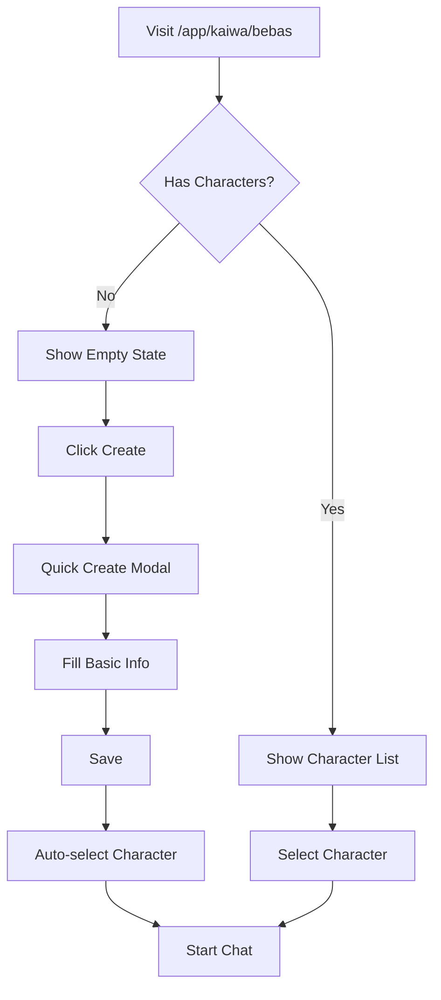

# GengoBot - Implementation Phases for Sitemap Changes

## 📋 Daftar Isi

- [Overview](#overview)
- [Current vs New Structure](#current-vs-new-structure)
- [Migration Strategy](#migration-strategy)
- [Phase 1: Foundation & Routing](#phase-1-foundation--routing)
- [Phase 2: Core Features](#phase-2-core-features)
- [Phase 3: Advanced Features](#phase-3-advanced-features)
- [Phase 4: Polish & Optimization](#phase-4-polish--optimization)
- [Testing Strategy](#testing-strategy)
- [Deployment Plan](#deployment-plan)

---

## 🎯 Overview

**Objective**: Migrate dari struktur routing lama ke struktur baru sesuai SITEMAP.md yang telah direvisi.

**Timeline**: 4 Phases - Estimasi 6-8 minggu total

**Approach**:

- Incremental migration (tidak big bang)
- Backward compatibility selama transisi
- Feature flag untuk rollout bertahap
- Database migration terpisah dari routing changes

---

## 📊 Current vs New Structure

### **Major Routing Changes**

| Area            | Current Route           | New Route                 | Change Type                      |
| --------------- | ----------------------- | ------------------------- | -------------------------------- |
| **Dashboard**   | `/dashboard`            | `/app`                    | Rename (remove dashboard prefix) |
| **Tasks**       | `/dashboard/tasks`      | `/app/kaiwa/roleplay`     | Move + Rename                    |
| **Chat**        | `/dashboard/chat`       | `/app/kaiwa/bebas`        | Move + Rename                    |
| **Voice Chat**  | `/chat-webrtc`          | ARCHIVED                  | Remove from navigation           |
| **Study**       | `/study/*`              | `/app/drill/*`            | Rename + Move inside /app        |
| **Characters**  | `/dashboard/characters` | `/app/profile/characters` | Move                             |
| **Progress**    | `/dashboard/progress`   | `/app/profile/progress`   | Move                             |
| **Settings**    | `/dashboard/settings`   | `/app/profile/settings`   | Move                             |
| **Kaiwa Hub**   | (new)                   | `/app/kaiwa`              | New feature                      |
| **Profile Hub** | (new)                   | `/app/profile`            | New feature                      |
| **Ujian/Exam**  | (new)                   | `/app/ujian`              | New (Coming Soon)                |

### **New Routes to Create**

| Route                 | Purpose                                       | Priority |
| --------------------- | --------------------------------------------- | -------- |
| `/app`                | Main dashboard/home (renamed from /dashboard) | Critical |
| `/app/kaiwa`          | Kaiwa hub (entry point)                       | High     |
| `/app/kaiwa/bebas`    | Free conversation (replaces chat + webrtc)    | High     |
| `/app/kaiwa/roleplay` | Task-based practice (replaces tasks)          | High     |
| `/app/profile`        | Profile hub                                   | High     |
| `/app/ujian`          | Exam section (Coming Soon placeholder)        | Medium   |
| `/app/drill`          | Drill hub (rename from /study, inside /app)   | High     |
| `/termsofservice`     | Terms of Service page                         | Medium   |
| `/privacypolicy`      | Privacy Policy page                           | Medium   |

### **Routes to Keep (No Change)**

- `/` - Landing page
- `/login` - Login page
- `/auth/error` - Auth error page
- `/admin/*` - All admin routes (unchanged)

---

## 🔄 Migration Strategy

### **Principles**

1. **No Breaking Changes**: Old URLs redirect to new URLs
2. **Data Preservation**: All user data migrated seamlessly
3. **Gradual Rollout**: Feature flags for controlled deployment
4. **Rollback Ready**: Easy rollback if issues arise

### **Redirect Strategy**

```typescript
// Middleware redirects for backward compatibility
const ROUTE_REDIRECTS = {
  // Dashboard → App
  '/dashboard': '/app',
  '/dashboard/:path*': '/app/:path*',

  // Tasks → Kaiwa Roleplay
  '/dashboard/tasks': '/app/kaiwa/roleplay',
  '/dashboard/tasks/:path*': '/app/kaiwa/roleplay/:path*',

  // Chat → Kaiwa Bebas
  '/dashboard/chat': '/app/kaiwa/bebas',

  // WebRTC → Kaiwa Bebas (archived)
  '/chat-webrtc': '/app/kaiwa/bebas',

  // Study → Drill (note: drill is now inside /app)
  '/study': '/app/drill',
  '/study/:path*': '/app/drill/:path*',

  // Profile routes
  '/dashboard/characters': '/app/profile/characters',
  '/dashboard/characters/:path*': '/app/profile/characters/:path*',
  '/dashboard/progress': '/app/profile/progress',
  '/dashboard/settings': '/app/profile/settings',
};
```

### **Feature Flags**

```typescript
const FEATURE_FLAGS = {
  NEW_ROUTING: process.env.NEXT_PUBLIC_NEW_ROUTING === 'true',
  KAIWA_HUB: process.env.NEXT_PUBLIC_KAIWA_HUB === 'true',
  PROFILE_HUB: process.env.NEXT_PUBLIC_PROFILE_HUB === 'true',
  DRILL_RENAME: process.env.NEXT_PUBLIC_DRILL_RENAME === 'true',
};
```

---

## 🚀 Phase 1: Foundation & Routing (Week 1-2)

### **Goals**

- Set up new routing structure
- Implement redirects
- Update middleware
- Prepare database migrations

### **Tasks**

#### **1.1 Create New Route Folders** ✅ Priority: Critical

```bash
# IMPORTANT: Main structure change - rename dashboard → app
# Move: src/app/dashboard/ → src/app/app/

# New directories to create under src/app/app/
src/app/app/
├── page.tsx                    # Main dashboard (formerly /dashboard)
├── kaiwa/
│   ├── page.tsx               # Kaiwa hub
│   ├── bebas/
│   │   └── page.tsx           # Free conversation
│   └── roleplay/
│       ├── page.tsx           # Task list
│       ├── [taskId]/
│       │   ├── page.tsx       # Pre-study
│       │   └── attempt/
│       │       └── page.tsx   # Active session
│
├── profile/
│   ├── page.tsx               # Profile hub
│   ├── settings/
│   │   └── page.tsx
│   ├── progress/
│   │   └── page.tsx
│   └── characters/
│       ├── page.tsx
│       ├── new/
│       │   └── page.tsx
│       └── [id]/
│           └── edit/
│               └── page.tsx
│
├── ujian/
│   └── page.tsx               # Coming Soon placeholder
│
└── drill/
    ├── page.tsx               # Drill hub
    ├── my-decks/
    │   └── page.tsx
    ├── decks/
    │   ├── new/
    │   │   └── page.tsx
    │   └── [deckId]/
    │       ├── page.tsx
    │       └── edit/
    │           └── page.tsx
    └── [deckId]/
        └── page.tsx           # Active study session

```

**Acceptance Criteria**:

- [ ] All new folders created
- [ ] Placeholder pages render "Coming Soon"
- [ ] Routes accessible without errors

#### **1.2 Update Middleware for Redirects** ✅ Priority: Critical

**File**: `src/middleware.ts`

```typescript
// Add redirect map
const LEGACY_REDIRECTS: Record<string, string> = {
  '/dashboard/tasks': '/kaiwa/roleplay',
  '/dashboard/tasks/:path*': '/kaiwa/roleplay/:path*',
  '/dashboard/chat': '/kaiwa/bebas',
  '/chat-webrtc': '/kaiwa/bebas',
  '/study': '/drill',
  '/study/:path*': '/drill/:path*',
  '/dashboard/characters': '/profile/characters',
  '/dashboard/characters/:path*': '/profile/characters/:path*',
  '/dashboard/progress': '/profile/progress',
  '/dashboard/settings': '/profile/settings',
};

// Implement redirect logic
export async function middleware(request: NextRequest) {
  const { pathname } = request.nextUrl;

  // Check for legacy routes
  for (const [oldPath, newPath] of Object.entries(LEGACY_REDIRECTS)) {
    if (matchPath(pathname, oldPath)) {
      const url = request.nextUrl.clone();
      url.pathname = newPath.replace(':path*', pathname.split('/').slice(3).join('/'));
      return NextResponse.redirect(url);
    }
  }

  // Existing auth logic...
}
```

**Acceptance Criteria**:

- [ ] All legacy URLs redirect correctly
- [ ] Query parameters preserved
- [ ] Auth checks still work
- [ ] No infinite redirect loops

#### **1.3 Update Navigation Components** ✅ Priority: High

**Files to Update**:

- `src/components/dashboard/app-sidebar.tsx` → rename to `src/components/app/app-sidebar.tsx`
- `src/components/dashboard/dashboard-header.tsx` → rename to `src/components/app/app-header.tsx`

**Changes**:

```typescript
// OLD
const items = [
  { title: 'Dasbor', url: '/dashboard', icon: Home },
  { title: 'Tugas', url: '/dashboard/tasks', icon: GraduationCap },
  { title: 'Dek Belajar', url: '/study', icon: BookOpen },
  { title: 'Obrolan', url: '/dashboard/chat', icon: MessageSquare },
  { title: 'Obrolan Suara', url: '/chat-webrtc', icon: Mic },
  { title: 'Kemajuan', url: '/dashboard/progress', icon: TrendingUp },
  { title: 'Karakter', url: '/dashboard/characters', icon: Users },
];

const bottomItems = [{ title: 'Pengaturan', url: '/dashboard/settings', icon: Settings }];

// NEW - Simplified 4-item navigation
const items = [
  { title: 'Beranda', url: '/app', icon: Home },
  { title: 'Kaiwa', url: '/app/kaiwa', icon: MessageSquare },
  { title: 'Drill', url: '/app/drill', icon: BookOpen },
  { title: 'Ujian', url: '/app/ujian', icon: GraduationCap, badge: 'Soon' },
];

const bottomItems = [{ title: 'Profile', url: '/app/profile', icon: User }];

// NOTE: WebRTC archived - removed from navigation
```

**Acceptance Criteria**:

- [ ] Sidebar shows new navigation structure
- [ ] Active state highlights correct route
- [ ] Icons updated appropriately
- [ ] Mobile navigation works

#### **1.4 Create Public Pages** ✅ Priority: Medium

**Files to Create**:

- `src/app/termsofservice/page.tsx`
- `src/app/privacypolicy/page.tsx`

**Acceptance Criteria**:

- [ ] Pages accessible
- [ ] Basic content placeholder
- [ ] Links in footer work
- [ ] SEO meta tags present

### **Phase 1 Deliverables**

- ✅ All new route folders created
- ✅ Middleware redirects working
- ✅ Navigation updated
- ✅ Public pages live
- ✅ No broken links in app

**Testing Checklist**:

- [ ] Navigate to old URLs → redirects work
- [ ] Navigation sidebar → all links work
- [ ] Mobile navigation → functional
- [ ] Auth protection → still enforced
- [ ] Admin routes → unchanged

---

## 🏗️ Phase 2: Core Features (Week 3-4)

### **Goals**

- Migrate task system to Kaiwa Roleplay
- Migrate chat to Kaiwa Bebas
- Rename Study to Drill
- Create hub pages (Kaiwa, Profile)

### **Tasks**

#### **2.1 Build Kaiwa Hub** ✅ Priority: Critical

**File**: `src/app/app/kaiwa/page.tsx`

**Features**:

- Overview of Kaiwa features
- Quick stats (practice time, sessions)
- Two main cards: "Ngobrol Bebas" & "Roleplay"
- Navigation to both sub-features

**Components to Create**:

- `src/components/kaiwa/kaiwa-hub.tsx`
- `src/components/kaiwa/kaiwa-stats-card.tsx`

**Acceptance Criteria**:

- [ ] Hub page renders
- [ ] Stats show real user data
- [ ] Navigation to bebas/roleplay works
- [ ] Responsive design

#### **2.2 Migrate Chat to Kaiwa Bebas** ✅ Priority: Critical

**Current**: `src/app/dashboard/chat/page.tsx`
**New**: `src/app/app/kaiwa/bebas/page.tsx`

**IMPORTANT**: This also replaces `/chat-webrtc` - merge voice features into Kaiwa Bebas

**Migration Steps**:

1. Copy existing chat page to new location
2. Update imports and paths
3. Integrate voice chat features from `/chat-webrtc`
4. Add character selection/creation
5. Update API endpoints if needed

**Components to Update**:

- `src/components/chat/*` → move to `src/components/kaiwa/bebas/`
- Integrate WebRTC components

**Database Changes**:

```sql
-- Update conversation records to new route references
UPDATE conversations
SET route_source = 'app/kaiwa/bebas'
WHERE route_source IN ('dashboard/chat', 'chat-webrtc');

-- Archive WebRTC-specific sessions (if separate table)
UPDATE webrtc_sessions
SET archived = true, migration_note = 'Merged into kaiwa/bebas'
WHERE archived = false;
```

**Acceptance Criteria**:

- [ ] Chat functionality works at new URL
- [ ] Character selection integrated
- [ ] Voice mode toggle works
- [ ] Message history preserved
- [ ] Real-time updates functional

#### **2.3 Migrate Tasks to Kaiwa Roleplay** ✅ Priority: Critical

**Current Files**:

- `src/app/dashboard/tasks/page.tsx`
- `src/app/dashboard/tasks/[taskId]/pre-study/page.tsx`
- `src/app/dashboard/tasks/[taskId]/attempt/[attemptId]/page.tsx`

**New Files**:

- `src/app/app/kaiwa/roleplay/page.tsx` (task list)
- `src/app/app/kaiwa/roleplay/[taskId]/page.tsx` (pre-study)
- `src/app/app/kaiwa/roleplay/[taskId]/attempt/page.tsx` (active session)

**Migration Steps**:

1. Copy task components to new location
2. Update all route references
3. Update breadcrumbs
4. Fix navigation links
5. Update API calls if needed

**Components to Move**:

- `src/components/tasks/*` → `src/components/kaiwa/roleplay/`

**Database Changes**:

```sql
-- Update task attempt records
UPDATE task_attempts
SET route_accessed = 'app/kaiwa/roleplay'
WHERE route_accessed LIKE 'dashboard/tasks%';
```

**Acceptance Criteria**:

- [ ] Task list shows at new URL
- [ ] Filters (JLPT, Category) work
- [ ] Task preview/pre-study loads
- [ ] Active session functional
- [ ] Feedback system works
- [ ] Progress tracking updates

#### **2.4 Rename Study to Drill** ✅ Priority: High

**Route Changes**:

```
/study          → /app/drill
/study/my-decks → /app/drill/my-decks
/study/decks/*  → /app/drill/decks/*
/study/[deckId] → /app/drill/[deckId]
/study/stats    → Integrate to /app/profile/progress
```

**Migration Steps**:

1. Create new `/app/drill` folder structure (inside /app)
2. Copy all study pages to drill
3. Update terminology: "Study" → "Drill"
4. Update navigation references (all to /app/drill/\*)
5. Implement redirects

**Components to Update**:

- Rename `src/components/study/*` → `src/components/drill/*`
- Update all import paths
- Change UI text: "Study Session" → "Drill Session"
- Update navigation links to `/app/drill/*`

**Database Changes**:

```sql
-- Update deck access logs
UPDATE deck_study_sessions
SET route_type = 'app/drill'
WHERE route_type IN ('study', 'drill');

-- Update route references
UPDATE user_activity_logs
SET route = REPLACE(route, '/study/', '/app/drill/')
WHERE route LIKE '/study/%';
```

**Acceptance Criteria**:

- [ ] All drill pages accessible
- [ ] Deck list shows correctly
- [ ] Study session works (renamed to drill)
- [ ] SRS algorithm unchanged
- [ ] Progress tracked correctly

#### **2.5 Build Profile Hub** ✅ Priority: High

**File**: `src/app/app/profile/page.tsx`

**Features**:

- User profile overview
- Quick links to Settings, Progress, Characters
- Profile stats summary

**Components to Create**:

- `src/components/profile/profile-hub.tsx`
- `src/components/profile/profile-card.tsx`

**Acceptance Criteria**:

- [ ] Hub page renders
- [ ] User info displays correctly
- [ ] Navigation to sub-pages works
- [ ] Profile picture/avatar shows

#### **2.6 Migrate Profile Sub-Features** ✅ Priority: High

**Settings**:

- `src/app/dashboard/settings/page.tsx` → `src/app/app/profile/settings/page.tsx`

**Progress**:

- `src/app/dashboard/progress/page.tsx` → `src/app/app/profile/progress/page.tsx`

**Characters**:

- `src/app/dashboard/characters/*` → `src/app/app/profile/characters/*`

**Migration Steps**:

1. Copy pages to new locations
2. Update breadcrumbs
3. Update navigation contexts
4. Test all functionality

**Acceptance Criteria**:

- [ ] Settings page functional
- [ ] Progress charts render
- [ ] Character CRUD works
- [ ] All forms submit correctly

#### **2.7 Create Ujian (Exam) Placeholder** ✅ Priority: Medium

**File**: `src/app/app/ujian/page.tsx`

**Features**:

- "Coming Soon" page with preview
- Subscribe to updates (email collection)
- Explanation of future JLPT exam features

**Component**:

```typescript
// src/app/app/ujian/page.tsx
export default function UjianPage() {
  return (
    <div className="flex flex-col items-center justify-center min-h-screen">
      <h1>Ujian JLPT</h1>
      <p>Coming Soon</p>
      <p>Persiapan ujian JLPT dengan AI akan segera hadir!</p>
      {/* Email subscription form */}
    </div>
  );
}
```

**Acceptance Criteria**:

- [ ] Page accessible at `/app/ujian`
- [ ] Shows "Coming Soon" message
- [ ] Navigation badge shows "Soon"
- [ ] Responsive design

### **Phase 2 Deliverables**

- ✅ Kaiwa hub live
- ✅ Kaiwa Bebas (chat + webrtc) migrated
- ✅ Kaiwa Roleplay (tasks) migrated
- ✅ Drill (study) renamed and migrated
- ✅ Profile hub and sub-features migrated
- ✅ Ujian placeholder created
- ✅ All redirects in place
- ✅ WebRTC archived

**Testing Checklist**:

- [ ] Complete user journey: /app → Kaiwa → Roleplay → Task completion
- [ ] Character creation from Kaiwa Bebas works
- [ ] Voice mode toggle works (WebRTC features integrated)
- [ ] Drill session completes successfully
- [ ] Profile data displays correctly
- [ ] Ujian page shows "Coming Soon"
- [ ] No data loss during migration
- [ ] All old URLs redirect correctly

---

## 🎨 Phase 3: Advanced Features (Week 5-6)

### **Goals**

- Enhance Kaiwa Bebas with inline character creation
- Implement cross-feature integrations
- Add mobile-specific optimizations
- Build dashboard stat cards

### **Tasks**

#### **3.1 Dashboard Stats Enhancement** ✅ Priority: High

**File**: `src/app/app/page.tsx` (main home/dashboard)

**New Features**:

- **Stats Cards**:
  - 🎙️ Menit latihan kaiwa (from task attempts + chat sessions)
  - 📚 Kartu yang sudah hafal (from drill SRS data)
  - 📊 Stats satu minggu (7-day activity chart)
- **Recent Activity** feed

**Components to Create**:

- `src/components/dashboard/stats-card.tsx`
- `src/components/dashboard/activity-chart.tsx`
- `src/components/dashboard/recent-activity.tsx`

**API Endpoints**:

```typescript
// GET /api/stats/kaiwa
{
  totalMinutes: 45,
  sessionsCount: 12,
  weeklyBreakdown: [...]
}

// GET /api/stats/drill
{
  totalCards: 250,
  masteredCards: 120,
  masteryPercentage: 48
}

// GET /api/stats/weekly
{
  dates: [...],
  kaiwaMinutes: [...],
  cardsLearned: [...]
}

// GET /api/activity/recent
[
  { type: 'task_complete', data: {...}, timestamp: ... },
  { type: 'cards_learned', data: {...}, timestamp: ... }
]
```

**Acceptance Criteria**:

- [ ] Stats cards show real-time data
- [ ] Weekly chart renders correctly
- [ ] Recent activity updates live
- [ ] Click stats card → navigate to detail page
- [ ] Loading states handled

#### **3.2 Inline Character Creation in Kaiwa Bebas** ✅ Priority: Medium

**File**: `src/app/app/kaiwa/bebas/page.tsx`

**Features**:

- Detect if user has no characters
- Show "Create First Character" prompt
- Quick character creation modal
- Auto-select new character after creation
- Start chat immediately

**Components to Create**:

- `src/components/kaiwa/bebas/character-quick-create-modal.tsx`
- `src/components/kaiwa/bebas/empty-character-state.tsx`

**Flow**:



**Acceptance Criteria**:

- [ ] Empty state shows for new users
- [ ] Quick create modal functional
- [ ] Character saved successfully
- [ ] Chat starts immediately after creation
- [ ] Can still access full character creation in Profile

#### **3.3 Cross-Feature Integration** ✅ Priority: Medium

**Save Word from Roleplay to Drill**:

**Implementation**:

- During roleplay session (`/app/kaiwa/roleplay/[taskId]/attempt`), show "Save to Deck" button for vocabulary
- Modal to select target deck (or create new)
- API to add card to drill deck
- After saving, option to "Go to Drill" → `/app/drill/my-decks`

**Components to Create**:

- `src/components/kaiwa/roleplay/save-word-button.tsx`
- `src/components/kaiwa/roleplay/save-word-modal.tsx`

**API Endpoint**:

```typescript
// POST /api/drill/cards/quick-add
{
  deckId: string,
  word: string,
  reading: string,
  translation: string,
  exampleSentence: string,
  source: 'kaiwa_roleplay',
  taskId: string
}
```

**Acceptance Criteria**:

- [ ] Save button appears during roleplay
- [ ] Deck selection works
- [ ] Card saved to selected deck
- [ ] Success notification shown
- [ ] Can view saved card in drill

**Suggest Kaiwa after Drill Session**:

**Implementation**:

- After drill session complete screen, show suggestion
- "Practice speaking with these words in Kaiwa?"
- Link directly to `/app/kaiwa/bebas` or `/app/kaiwa/roleplay`

**Components to Update**:

- `src/components/drill/session-complete.tsx`

**Acceptance Criteria**:

- [ ] Suggestion appears on session complete
- [ ] Links work correctly
- [ ] Can dismiss suggestion
- [ ] Preference remembered (localStorage)

#### **3.4 Mobile-Specific Optimizations** ✅ Priority: Medium

**Docked Navigation (Mobile)**:

**Implementation**:

- Bottom navigation bar for mobile
- Icons: Dasbor, Kaiwa, Drill, Profile
- Active state indication
- Hide on scroll down, show on scroll up

**Components to Create**:

- `src/components/layout/mobile-bottom-nav.tsx`

```typescript
const mobileNavItems = [
  { label: 'Beranda', href: '/app', icon: Home },
  { label: 'Kaiwa', href: '/app/kaiwa', icon: MessageSquare },
  { label: 'Drill', href: '/app/drill', icon: BookOpen },
  { label: 'Profile', href: '/app/profile', icon: User },
];
```

**Acceptance Criteria**:

- [ ] Bottom nav shows on mobile only
- [ ] Active state highlights correctly
- [ ] Hides on scroll down
- [ ] Shows on scroll up
- [ ] Touch-friendly hit areas

**Mobile Kaiwa Session**:

**Enhancements**:

- Full-screen mode
- Floating microphone button
- Swipe gestures (down to end session)
- Larger text for readability

**Acceptance Criteria**:

- [ ] Full-screen mode works
- [ ] Mic button accessible
- [ ] Swipe gestures functional
- [ ] Text readable on small screens

**Mobile Drill Session**:

**Enhancements**:

- Swipe left: "Belum Hafal"
- Swipe right: "Hafal"
- Tap to flip card
- Touch-friendly buttons

**Components to Update**:

- `src/components/drill/flashcard.tsx`

**Acceptance Criteria**:

- [ ] Swipe gestures work
- [ ] Tap to flip works
- [ ] Smooth animations
- [ ] Haptic feedback (if supported)

### **Phase 3 Deliverables**

- ✅ Dashboard stats cards live
- ✅ Inline character creation works
- ✅ Cross-feature integrations functional
- ✅ Mobile navigation optimized
- ✅ Mobile session UX enhanced

**Testing Checklist**:

- [ ] Dashboard stats update in real-time
- [ ] New user can create character inline
- [ ] Save word from roleplay → appears in drill
- [ ] Drill completion → suggests kaiwa
- [ ] Mobile bottom nav works
- [ ] Mobile swipe gestures functional

---

## ✨ Phase 4: Polish & Optimization (Week 7-8)

### **Goals**

- Performance optimization
- SEO improvements
- Analytics integration
- Documentation updates
- Final testing

### **Tasks**

#### **4.1 Performance Optimization** ✅ Priority: High

**Code Splitting**:

```typescript
// Lazy load heavy components
const KaiwaRoleplay = dynamic(() => import('@/components/kaiwa/roleplay'), {
  loading: () => <LoadingSpinner />
});

const DrillSession = dynamic(() => import('@/components/drill/session'), {
  ssr: false,
  loading: () => <LoadingState />
});
```

**Image Optimization**:

- Convert images to WebP
- Implement lazy loading
- Use Next.js Image component

**API Optimization**:

- Implement React Query for caching
- Add stale-while-revalidate
- Optimize database queries

**Acceptance Criteria**:

- [ ] Lighthouse score >90
- [ ] Time to Interactive <3s
- [ ] Bundle size reduced 20%
- [ ] No layout shift (CLS <0.1)

#### **4.2 SEO & Meta Tags** ✅ Priority: Medium

**Update Metadata**:

```typescript
// Each page gets proper metadata
export const metadata: Metadata = {
  title: 'Kaiwa Roleplay - GengoBot',
  description: 'Practice Japanese conversation with AI...',
  openGraph: {
    title: 'Kaiwa Roleplay - GengoBot',
    description: '...',
    images: ['/og-kaiwa.png'],
  },
};
```

**Sitemap Generation**:

- Create `sitemap.xml`
- Submit to Google Search Console

**Acceptance Criteria**:

- [ ] All pages have meta tags
- [ ] OpenGraph images set
- [ ] Sitemap generated
- [ ] robots.txt configured

#### **4.3 Analytics Integration** ✅ Priority: Medium

**Events to Track**:

```typescript
// Navigation events
trackEvent('navigation', { from: '/dashboard', to: '/kaiwa/bebas' });

// Feature usage
trackEvent('kaiwa_session_start', { type: 'bebas', characterId: '...' });
trackEvent('kaiwa_session_complete', { duration: 300, messages: 15 });

trackEvent('roleplay_task_start', { taskId: '...', jlptLevel: 'N5' });
trackEvent('roleplay_task_complete', { score: 85, duration: 480 });

trackEvent('drill_session_start', { deckId: '...', cardsCount: 15 });
trackEvent('drill_session_complete', { mastered: 8, duration: 600 });

// Cross-feature
trackEvent('save_word_to_deck', { source: 'roleplay', deckId: '...' });
```

**Tools**:

- Google Analytics 4
- Mixpanel (optional)
- Sentry for error tracking

**Acceptance Criteria**:

- [ ] Events tracking implemented
- [ ] Dashboard shows analytics
- [ ] User privacy respected (GDPR)
- [ ] Error tracking active

#### **4.4 Documentation Updates** ✅ Priority: Low

**Update Files**:

- `README.md` - New routing structure
- `CONTRIBUTING.md` - Development guidelines
- API documentation
- Component Storybook

**Acceptance Criteria**:

- [ ] README updated
- [ ] API docs current
- [ ] Storybook stories updated
- [ ] Migration guide written

#### **4.5 Final Testing & QA** ✅ Priority: Critical

**Test Scenarios**:

| Scenario            | Steps                                                     | Expected Result              |
| ------------------- | --------------------------------------------------------- | ---------------------------- |
| New User Journey    | Login → Dashboard → Create Character → Kaiwa Bebas → Chat | Smooth onboarding            |
| Task Completion     | Dashboard → Kaiwa → Roleplay → Select Task → Complete     | Task marked complete         |
| Drill Session       | Dashboard → Drill → My Decks → Study → Complete 10 cards  | Stats updated                |
| Cross-Feature       | Roleplay → Save word → Drill → Find saved card            | Card appears                 |
| Mobile Navigation   | Use bottom nav on mobile                                  | All routes accessible        |
| Redirect Legacy URL | Visit /dashboard/tasks                                    | Redirects to /kaiwa/roleplay |

**Regression Testing**:

- [ ] Admin panel still works
- [ ] Auth flow unchanged
- [ ] All forms submit
- [ ] Data integrity maintained

**Performance Testing**:

- [ ] Load testing (100 concurrent users)
- [ ] Database query performance
- [ ] API response times <200ms

**Cross-Browser Testing**:

- [ ] Chrome ✅
- [ ] Firefox ✅
- [ ] Safari ✅
- [ ] Edge ✅
- [ ] Mobile Safari ✅
- [ ] Mobile Chrome ✅

### **Phase 4 Deliverables**

- ✅ Performance optimized (Lighthouse >90)
- ✅ SEO configured
- ✅ Analytics tracking live
- ✅ Documentation updated
- ✅ All tests passing
- ✅ Production ready

---

## 🧪 Testing Strategy

### **Unit Tests**

**Coverage Target**: >80%

**Key Areas**:

- Component rendering
- Business logic functions
- API route handlers
- Database queries

```bash
npm run test:unit
npm run test:coverage
```

### **Integration Tests**

**Tools**: Playwright, Cypress

**Scenarios**:

- User flows (login → task → completion)
- Navigation flows
- Form submissions
- API integrations

```bash
npm run test:e2e
```

### **Manual Testing**

**Checklist**:

- [ ] All user flows documented in DASHBOARD_USER_FLOW.md
- [ ] Edge cases tested
- [ ] Error states verified
- [ ] Loading states checked
- [ ] Responsive design confirmed

---

## 🚢 Deployment Plan

### **Pre-Deployment**

**Environment Setup**:

```bash
# Staging environment
NEXT_PUBLIC_NEW_ROUTING=true
NEXT_PUBLIC_KAIWA_HUB=true
NEXT_PUBLIC_PROFILE_HUB=true
NEXT_PUBLIC_DRILL_RENAME=true
```

**Database Backup**:

```bash
# Backup production DB before migration
pg_dump gengobot_prod > backup_pre_migration_$(date +%Y%m%d).sql
```

### **Deployment Sequence**

#### **Step 1: Deploy to Staging**

- Deploy all changes to staging
- Run database migrations
- Test all features
- Performance testing
- Security audit

#### **Step 2: Gradual Production Rollout**

**Week 1: 10% Traffic**

- Enable new routing for 10% of users
- Monitor metrics closely
- Collect user feedback

**Week 2: 50% Traffic**

- If no issues, increase to 50%
- Continue monitoring
- A/B test performance

**Week 3: 100% Traffic**

- Full rollout
- Announce changes to users
- Update documentation

**Week 4: Cleanup**

- Remove feature flags
- Delete old route files
- Update monitoring

### **Rollback Plan**

**If Critical Issues**:

1. Disable feature flags (instant rollback)
2. Restore database from backup if needed
3. Deploy previous version
4. Investigate issues
5. Fix and re-deploy

**Rollback Commands**:

```bash
# Disable new routing
vercel env add NEXT_PUBLIC_NEW_ROUTING false

# Redeploy previous version
vercel --prod --force
```

### **Post-Deployment**

**Monitoring**:

- Error rates (target: <0.1%)
- Response times (target: <200ms)
- User engagement metrics
- Conversion rates

**User Communication**:

- In-app announcement about new structure
- Email to active users
- Tutorial/walkthrough for changes
- Support documentation updated

---

## 📊 Success Metrics

### **Technical Metrics**

| Metric            | Current | Target | Measurement |
| ----------------- | ------- | ------ | ----------- |
| Page Load Time    | 2.5s    | <2s    | Lighthouse  |
| API Response Time | 250ms   | <200ms | APM         |
| Error Rate        | 0.5%    | <0.1%  | Sentry      |
| Bundle Size       | 500KB   | <400KB | Build stats |
| Lighthouse Score  | 85      | >90    | CI/CD       |

### **User Experience Metrics**

| Metric               | Current | Target | Measurement |
| -------------------- | ------- | ------ | ----------- |
| Task Completion Rate | 65%     | >80%   | Analytics   |
| Session Duration     | 8min    | >12min | Analytics   |
| Bounce Rate          | 35%     | <25%   | Analytics   |
| User Retention (7d)  | 40%     | >50%   | Database    |
| NPS Score            | 35      | >50    | Survey      |

### **Engagement Metrics**

| Feature                  | Current | Target | Measurement |
| ------------------------ | ------- | ------ | ----------- |
| Kaiwa Sessions/User/Week | 2.5     | >4     | Analytics   |
| Drill Cards/Day          | 15      | >25    | Analytics   |
| Character Creation Rate  | 30%     | >60%   | Database    |
| Cross-Feature Usage      | 20%     | >40%   | Analytics   |

---

## 🔧 Technical Debt & Future Work

### **Phase 5 (Future)**

**Nice-to-Have Features**:

- [ ] JLPT prep section (`/jlpt`)
- [ ] Community features (share decks)
- [ ] Leaderboards
- [ ] Advanced analytics dashboard
- [ ] Voice-to-text improvements
- [ ] Real-time collaboration
- [ ] Native mobile apps

### **Technical Improvements**:

- [ ] Migrate to React Server Components (App Router optimization)
- [ ] Implement partial prerendering
- [ ] Add service worker for offline support
- [ ] Implement WebSocket for real-time features
- [ ] Optimize database indexes
- [ ] Implement CDN for assets

---

## 📝 Dependencies & Prerequisites

### **Before Starting**

**Required**:

- [ ] Product team sign-off on new structure
- [ ] Design mockups approved
- [ ] Database migration plan reviewed
- [ ] Backup strategy tested
- [ ] Staging environment ready

**Team Alignment**:

- [ ] Developers briefed on changes
- [ ] QA team has test plans
- [ ] DevOps ready for deployment
- [ ] Support team trained on new structure
- [ ] Marketing aware of changes

---

## 🎯 Summary Timeline

| Phase       | Duration | Key Deliverables                               | Status     |
| ----------- | -------- | ---------------------------------------------- | ---------- |
| **Phase 1** | Week 1-2 | Routing foundation, redirects, navigation      | 🔜 Ready   |
| **Phase 2** | Week 3-4 | Core feature migration (Kaiwa, Drill, Profile) | 📅 Planned |
| **Phase 3** | Week 5-6 | Advanced features, integrations, mobile        | 📅 Planned |
| **Phase 4** | Week 7-8 | Polish, optimization, testing, deployment      | 📅 Planned |

**Total Estimated Time**: 8 weeks (2 months)

**Team Size**: 2-3 developers + 1 QA + 1 DevOps

---

## 📞 Contacts & Resources

**Project Lead**: [Name]
**Technical Lead**: [Name]
**QA Lead**: [Name]

**Documentation**:

- [SITEMAP.md](./SITEMAP.md) - Complete sitemap
- [DASHBOARD_USER_FLOW.md](./DASHBOARD_USER_FLOW.md) - User flow details
- [README.md](./README.md) - Project overview

**Tools**:

- Project Management: [Link to Jira/Trello]
- Design: [Link to Figma]
- API Docs: [Link to Swagger/Postman]

---

**Last Updated**: 2025-01-17
**Version**: 1.0
**Status**: Ready for Review
