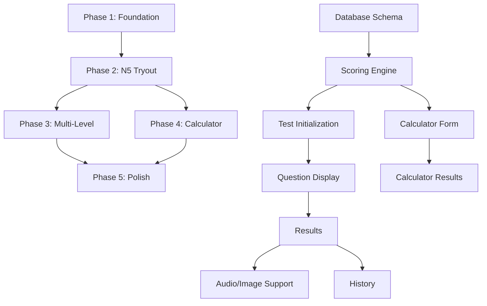

# JLPT Tryout & Calculator - MVP Development Plan

**Project**: Gengobot JLPT Feature
**Version**: 1.0
**Created**: 2025-12-28
**Status**: Planning Phase
**Target Timeline**: 6-8 weeks for MVP

---

## Table of Contents

1. [MVP Scope](#1-mvp-scope)
2. [Feature Breakdown](#2-feature-breakdown)
3. [Technical Architecture](#3-technical-architecture)
4. [Development Phases](#4-development-phases)
5. [Implementation Roadmap](#5-implementation-roadmap)
6. [Success Metrics](#6-success-metrics)
7. [Risk Mitigation](#7-risk-mitigation)

---

## 1. MVP Scope

### 1.1 Core Features (Must Have)

#### Feature 1: JLPT Online Tryout

- **Description**: Full-scale practice tests for all JLPT levels (N5-N1)
- **Key Components**:
  - Complete test interface with timer
  - Three sections: Vocabulary, Grammar/Reading, Listening
  - Authentic JLPT scoring system with weighted normalization
  - Section submission locks (no going back)
  - Auto-save progress
  - Comprehensive result analysis with reference grades

#### Feature 2: Offline Test Calculator

- **Description**: Score calculator for external tests (Sou Matome, Kanzen Master, official samples)
- **Key Components**:
  - Manual score input per mondai
  - Same scoring algorithm as online tests
  - Historical score tracking
  - Export results for analysis

### 1.2 Excluded from MVP (Future Enhancements)

- ❌ Advanced analytics dashboard
- ❌ Question bank editing interface for non-admins
- ❌ Social features (leaderboards, sharing)
- ❌ Adaptive difficulty system
- ❌ Mobile native apps
- ❌ Audio question creation interface
- ❌ Multi-language interface (Japanese only for now)
- ❌ Integration with main Gengobot task system

---

## 2. Feature Breakdown

### 2.1 JLPT Online Tryout - Detailed Features

#### 2.1.1 Test Selection

- **User Story**: As a learner, I want to select my JLPT level to take a practice test
- **Requirements**:
  - Display all 5 levels (N5-N1) with descriptions
  - Show estimated time per section
  - Display number of questions per section
  - Quick preview of test structure
- **UI Components**:
  - Level selection cards with icons
  - Test info modal
  - Start test button with confirmation

#### 2.1.2 Test Taking Interface

- **User Story**: As a test taker, I want an interface that mimics the real JLPT experience
- **Requirements**:
  - Section-by-section navigation (Vocabulary → Grammar/Reading → Listening)
  - Real-time countdown timer per section
  - Question navigation within current section
  - Answer selection with visual feedback
  - Flag/bookmark questions for review
  - Progress indicator (questions answered/total)
  - Submit section confirmation
  - Auto-submit on timer expiration
- **UI Components**:
  - Timer widget (sticky)
  - Question card with passage/audio player
  - Answer choice buttons (deterministic shuffle)
  - Navigation breadcrumb
  - Section progress bar
  - Review modal before section submission

#### 2.1.3 Question Display

- **User Story**: As a test taker, I want to see questions clearly with all necessary context
- **Requirements**:
  - **Text passages**: Readable font, proper spacing
  - **Audio questions**: Embedded player with replay option (limited)
  - **Image graphics**: High-quality display with zoom
  - **Cloze tests**: Highlighted blank positions
  - **Grouped questions**: Clear association with passage/audio
  - **Answer choices**: Randomized but consistent per session
- **UI Components**:
  - Passage card (collapsible for long texts)
  - Audio player with waveform
  - Image viewer with lightbox
  - Answer choice grid (4 options)
  - Question number indicator

#### 2.1.4 Scoring & Results

- **User Story**: As a test taker, I want to see my detailed results immediately after completing the test
- **Requirements**:
  - Overall score (0-180 scale)
  - Section scores (0-60 each)
  - Pass/fail determination
  - Reference grades (A/B/C) per section
  - Breakdown by mondai
  - Correct/incorrect answers with explanations
  - Time spent per section
  - Historical comparison (if repeat test)
- **UI Components**:
  - Results dashboard
  - Score visualization (charts)
  - Section breakdown table
  - Question review interface
  - Download PDF report button

#### 2.1.5 Test History

- **User Story**: As a learner, I want to track my progress over multiple attempts
- **Requirements**:
  - List all completed tests by level
  - Show score trends over time
  - Compare attempts side-by-side
  - Filter by date range and level
  - Export history as CSV
- **UI Components**:
  - Test history table with sorting
  - Score trend line chart
  - Comparison view
  - Filter controls

### 2.2 Offline Test Calculator - Detailed Features

#### 2.2.1 Score Input Interface

- **User Story**: As a self-study learner, I want to calculate my JLPT score from practice books
- **Requirements**:
  - Select JLPT level
  - Input source (Sou Matome, Kanzen Master, etc.)
  - Per-mondai score entry (correct/total)
  - Visual validation (highlights incomplete entries)
  - Save & calculate button
  - Reset button
- **UI Components**:
  - Level selector dropdown
  - Source input field (text)
  - Mondai score grid (section-grouped)
  - Calculate button
  - Form validation indicators

#### 2.2.2 Calculator Results

- **User Story**: As a user, I want to see if I would pass based on my practice test scores
- **Requirements**:
  - Overall score (0-180)
  - Section scores (0-60 each)
  - Pass/fail with reasoning
  - Reference grades per section
  - Display calculation breakdown
  - Save to history
- **UI Components**:
  - Results card
  - Score breakdown table
  - Pass/fail badge
  - Save history button

#### 2.2.3 Calculator History

- **User Story**: As a user, I want to track my progress across multiple practice tests
- **Requirements**:
  - List all saved calculations
  - Show source and date
  - Display scores at a glance
  - Delete individual entries
  - Export as CSV
- **UI Components**:
  - History table
  - Score trend chart
  - Filter by level/source
  - Export button

---

## 3. Technical Architecture

> **Important**: See [Schema Integration Guide](./SCHEMA-INTEGRATION.md) for detailed information on how JLPT tables integrate with the existing Gengobot schema.

### 3.1 Schema Integration Summary

**Integration Strategy**: Add JLPT-specific tables with `JLPT` prefix, use existing User/Admin models

**Key Points**:

- ✅ **Zero changes** to existing Gengobot tables
- ✅ **Isolated module** - can be removed without breaking core app
- ✅ Uses existing `User` model for authentication (add relations only)
- ✅ Uses existing `Admin` model for question management
- ✅ Uses existing `AnalyticsEvent` for tracking
- ✅ Optional credit integration (deferred to Phase 2)

**New Tables** (13 total):

- `JLPTPassage`, `JLPTQuestion`, `JLPTAnswerChoice`
- `JLPTQuestionUnit`, `JLPTUnitQuestion`
- `JLPTTestAttempt`, `JLPTSectionSubmission`, `JLPTUserAnswer`, `JLPTSectionScore`
- `JLPTOfflineTestResult`, `JLPTOfflineSectionScore`
- `JLPTQuestionAnalytics`, `JLPTScoringConfig`

### 3.2 Frontend Architecture

#### Technology Stack

- **Framework**: Next.js 15 (App Router) - **existing**
- **Language**: TypeScript - **existing**
- **Styling**: Tailwind CSS + shadcn/ui - **existing**
- **State Management**: React Context + Zustand (for test session)
- **Forms**: React Hook Form + Zod - **existing**
- **Charts**: Recharts
- **Audio Player**: Howler.js or native HTML5 audio

#### Key Pages & Routes

```
/jlpt
├── /tryout                      # Tryout landing page
│   ├── /[level]                 # Level selection (N5-N1)
│   │   └── /test/[attemptId]    # Active test session
│   └── /history                 # Test history
│
├── /calculator                  # Offline calculator landing
│   ├── /new                     # New calculation
│   └── /history                 # Calculation history
│
└── /results/[attemptId]         # Detailed results view
```

#### State Management

```typescript
// Test Session Store (Zustand)
interface TestSessionStore {
  attemptId: string;
  level: JLPTLevel;
  currentSection: SectionType;
  currentQuestion: number;
  answers: Record<string, number>; // questionId → choice_number
  flaggedQuestions: Set<string>;
  sectionStartTimes: Record<SectionType, number>;
  shuffleSeed: string;

  // Actions
  setAnswer: (questionId: string, choiceNumber: number) => void;
  toggleFlag: (questionId: string) => void;
  submitSection: (sectionType: SectionType) => Promise<void>;
  finishTest: () => Promise<void>;
}

// Calculator Store
interface CalculatorStore {
  level: JLPTLevel;
  source: string;
  mondaiScores: Record<string, { correct: number; total: number }>;

  // Actions
  setMondaiScore: (mondai: string, correct: number, total: number) => void;
  calculate: () => CalculatorResult;
  saveToHistory: () => Promise<void>;
}
```

### 3.3 Backend Architecture

#### Database Layer

- **ORM**: Prisma 5.x - **existing**
- **Database**: PostgreSQL 16+ - **existing**
- **Authentication**: NextAuth.js - **existing**

**Integration**:

- Reuse existing Prisma Client
- Add JLPT tables to existing schema
- Use existing auth middleware
- No separate database needed

#### API Routes

```
/api/jlpt
├── /tryout
│   ├── POST   /start              # Initialize test attempt
│   ├── GET    /questions          # Fetch questions for test
│   ├── POST   /answers            # Save user answers (auto-save)
│   ├── POST   /submit-section     # Submit section
│   ├── POST   /complete           # Complete test & calculate scores
│   └── GET    /results/[id]       # Get detailed results
│
├── /calculator
│   ├── POST   /calculate          # Calculate offline test score
│   ├── POST   /save               # Save calculation to history
│   └── GET    /history            # Get calculation history
│
└── /history
    ├── GET    /attempts           # Get all test attempts
    └── GET    /attempt/[id]       # Get specific attempt details
```

#### Database Schema (Prisma)

See [Schema Integration Guide](./SCHEMA-INTEGRATION.md) for complete integration details and [Database Design v2](./01-database-design-v2.md) for table specifications.

**JLPT Tables** (added to existing schema):

- `JLPTQuestion` - Question bank
- `JLPTPassage` - Reading/audio content
- `JLPTAnswerChoice` - Answer options
- `JLPTTestAttempt` - User test sessions
- `JLPTUserAnswer` - Individual answers
- `JLPTSectionScore` - Calculated section results
- `JLPTOfflineTestResult` - Calculator history
- `JLPTOfflineSectionScore` - Calculator section scores
- `JLPTScoringConfig` - Level-specific configurations

**Existing Tables** (used as-is):

- `User` - Authentication and profiles (add JLPT relations)
- `Admin` - Question management (add JLPT relations)
- `AnalyticsEvent` - Event tracking

### 3.3 Scoring Engine

**Location**: `src/lib/jlpt/scoring-engine.ts`

```typescript
// Core Functions
export function calculateSectionScore(
  level: JLPTLevel,
  section: SectionType,
  userAnswers: UserAnswer[]
): SectionScore;

export function calculateTotalScore(sectionScores: SectionScore[]): number;

export function evaluatePassFail(
  level: JLPTLevel,
  sectionScores: SectionScore[],
  totalScore: number
): PassFailResult;

export function calculateReferenceGrade(rawScore: number, totalQuestions: number): 'A' | 'B' | 'C';

// Special Cases
export function calculateN3DualNormalization(
  readingAnswers: UserAnswer[],
  grammarAnswers: UserAnswer[]
): N3SectionScore;
```

**Configuration**: `src/config/jlpt-mondai.ts`

See [Database Design v2](./01-database-design-v2.md) section 2.2 for complete config structure.

### 3.4 Question Randomization

**Deterministic Shuffling Algorithm**:

```typescript
// src/lib/jlpt/question-randomizer.ts
export function generateTest(
  level: JLPTLevel,
  userId: string
): {
  questionSnapshot: QuestionSnapshot;
  shuffleSeed: string;
};

export function getShuffledChoices(questionId: string, shuffleSeed: string): number[]; // Returns shuffled [1,2,3,4]
```

**Strategy**:

- Questions randomized per mondai while respecting units
- Answer choices shuffled deterministically per session
- Seed stored in `test_attempts.shuffle_seed`
- Same seed ensures consistent display during review

---

## 4. Development Phases

### Phase 1: Foundation (Week 1-2)

**Goal**: Setup core infrastructure and database

#### Tasks:

1. **Database Setup**
   - [ ] Create Prisma schema for all JLPT tables
   - [ ] Write migration files
   - [ ] Create seed script for N5 sample data (10 questions per mondai)
   - [ ] Test database constraints and triggers

2. **Configuration**
   - [ ] Implement `jlpt-mondai.ts` config file
   - [ ] Create TypeScript types for all JLPT entities
   - [ ] Setup validation schemas with Zod

3. **Scoring Engine**
   - [ ] Implement core scoring functions
   - [ ] Write unit tests for all scoring calculations
   - [ ] Test special cases (N3 dual normalization, N4/N5 combined)
   - [ ] Validate against known test results

4. **Basic UI Framework**
   - [ ] Create JLPT landing page
   - [ ] Setup shadcn/ui components
   - [ ] Create basic layout components (header, footer, sidebar)

**Deliverables**:

- ✅ Database schema deployed
- ✅ Scoring engine with 100% test coverage
- ✅ Configuration files finalized
- ✅ Basic navigation structure

---

### Phase 2: Online Tryout - Core Functionality (Week 3-4)

**Goal**: Build working online test system for N5

#### Tasks:

1. **Test Initialization**
   - [ ] Level selection page with UI
   - [ ] API: `POST /api/jlpt/tryout/start`
   - [ ] Generate test with question randomization
   - [ ] Store `test_attempts` record

2. **Test Taking Interface**
   - [ ] Question display component (text, passage support)
   - [ ] Answer selection with choice shuffling
   - [ ] Timer component with auto-submit
   - [ ] Progress tracker
   - [ ] Auto-save answers every 30 seconds
   - [ ] API: `POST /api/jlpt/tryout/answers`

3. **Section Management**
   - [ ] Section navigation (lock previous sections)
   - [ ] Submit section confirmation modal
   - [ ] API: `POST /api/jlpt/tryout/submit-section`
   - [ ] Store `section_submissions` records

4. **Test Completion**
   - [ ] Complete test flow
   - [ ] Calculate all section scores
   - [ ] Store `section_scores` records
   - [ ] Update `test_attempts` with final scores
   - [ ] API: `POST /api/jlpt/tryout/complete`

5. **Results Display**
   - [ ] Results page with overall score
   - [ ] Section score breakdown
   - [ ] Pass/fail badge
   - [ ] Reference grades display
   - [ ] Basic charts (radar, bar)

6. **Question Review Interface**
   - [ ] Show all questions with user's answers
   - [ ] Display correct answers
   - [ ] Mark correct/incorrect visually
   - [ ] Show explanations (if available)
   - [ ] Filter by section/mondai
   - [ ] Highlight flagged questions

7. **Time Tracking**
   - [ ] Record section start times
   - [ ] Calculate time spent per section
   - [ ] Display time analytics in results
   - [ ] Show average time per question

8. **End-to-End Testing**
   - [ ] Test initialization flow (Playwright)
   - [ ] Complete N5 test walkthrough (all sections)
   - [ ] Auto-save functionality verification
   - [ ] Section submission locks validation
   - [ ] Timer countdown and auto-submit
   - [ ] Score calculation accuracy
   - [ ] Results display verification
   - [ ] Error handling scenarios (network failures, session timeout)
   - [ ] Mobile responsive testing
   - [ ] Accessibility compliance (WCAG AA)

**Deliverables**:

- ✅ Working N5 test end-to-end
- ✅ Auto-save functionality
- ✅ Accurate scoring
- ✅ Basic results visualization

---

### Phase 3: Online Tryout - Full Feature Set (Week 5)

**Goal**: Extend to all levels and add advanced features

#### Tasks:

1. **Multi-Level Support**
   - [ ] Add N4 question data
   - [ ] Add N3 question data (with dual normalization)
   - [ ] Add N2 question data (combined sections)
   - [ ] Add N1 question data
   - [ ] Test scoring for all levels

2. **Advanced Question Types**
   - [ ] Integrate existing AudioPlayer component for listening questions
   - [ ] Add replay limit functionality to AudioPlayer (JLPT restriction)
   - [ ] Image viewer with lightbox
   - [ ] Cloze test rendering
   - [ ] Grouped question units
   - [ ] A-B comparison passages (N1/N2)

3. **Enhanced UX**
   - [ ] Flag/bookmark questions
   - [ ] Review modal before section submit
   - [ ] Keyboard shortcuts (next/prev question)
   - [ ] Mobile responsive design
   - [ ] Loading states and error handling

4. **Test History**
   - [ ] Test history page
   - [ ] API: `GET /api/jlpt/history/attempts`
   - [ ] Score trend chart
   - [ ] Filter by level and date
   - [ ] Comparison view (side-by-side attempts)

**Deliverables**:

- ✅ All 5 levels functional
- ✅ Audio and image questions working
- ✅ Complete test history system
- ✅ Mobile-friendly interface

---

### Phase 4: Offline Calculator (Week 6)

**Goal**: Build offline test score calculator

#### Tasks:

1. **Calculator Input Form**
   - [ ] Level selector
   - [ ] Source input field
   - [ ] Dynamic mondai score grid (based on level)
   - [ ] Form validation with Zod
   - [ ] Visual feedback for incomplete entries

2. **Calculation Engine**
   - [ ] Reuse scoring engine from online tests
   - [ ] API: `POST /api/jlpt/calculator/calculate`
   - [ ] Return results without saving

3. **Save to History**
   - [ ] Save calculation button
   - [ ] API: `POST /api/jlpt/calculator/save`
   - [ ] Store in `offline_test_results` table

4. **Calculator History**
   - [ ] History page
   - [ ] API: `GET /api/jlpt/calculator/history`
   - [ ] List all saved calculations
   - [ ] Delete functionality
   - [ ] Export as CSV

5. **Results Display**
   - [ ] Results card with scores
   - [ ] Pass/fail determination
   - [ ] Section breakdown table
   - [ ] Reference grades

**Deliverables**:

- ✅ Working calculator for all levels
- ✅ History tracking
- ✅ CSV export feature

---

### Phase 5: Polish & Testing (Week 7-8)

**Goal**: Refinement, testing, and deployment preparation

#### Tasks:

1. **Quality Assurance**
   - [ ] Write E2E tests with Playwright
     - [ ] Complete test flow (N5)
     - [ ] Calculator flow
     - [ ] History navigation
   - [ ] Write integration tests for APIs
   - [ ] Manual testing on multiple devices
   - [ ] Accessibility audit (WCAG AA)

2. **Performance Optimization**
   - [ ] Database query optimization (indexes)
   - [ ] Image optimization (Next.js Image)
   - [ ] Audio file lazy loading
   - [ ] Code splitting for question types
   - [ ] Lighthouse audit (target: 90+)

3. **Error Handling & Edge Cases**
   - [ ] Network failure recovery
   - [ ] Session timeout handling
   - [ ] Incomplete test recovery
   - [ ] Invalid input validation
   - [ ] Graceful degradation

4. **Documentation**
   - [ ] User guide (Japanese)
   - [ ] FAQ section
   - [ ] Admin guide for question management
   - [ ] API documentation
   - [ ] Database schema documentation (already done)

5. **Deployment**
   - [ ] Production database migration
   - [ ] Environment variables setup
   - [ ] CDN configuration for audio/images
   - [ ] Monitoring and logging setup
   - [ ] Backup strategy

**Deliverables**:

- ✅ Full test suite passing
- ✅ Performance optimized
- ✅ Documentation complete
- ✅ Production-ready deployment

---

## 5. Implementation Roadmap

### 5.1 Sprint Breakdown (2-week sprints)

#### Sprint 1 (Week 1-2): Foundation

**Focus**: Database, scoring engine, basic infrastructure

- Database schema finalization
- Scoring engine implementation
- Configuration setup
- Basic UI framework

**Success Criteria**:

- [ ] All tables created in database
- [ ] Scoring engine passes 100% unit tests
- [ ] Basic landing page deployed

---

#### Sprint 2 (Week 3-4): N5 Tryout MVP

**Focus**: Working end-to-end test for N5

- Test initialization flow
- Question display and answer selection
- Timer and progress tracking
- Section submission
- Results calculation and display

**Success Criteria**:

- [ ] User can complete full N5 test
- [ ] Scores calculated accurately
- [ ] Results displayed correctly
- [ ] Auto-save works reliably

---

#### Sprint 3 (Week 5): Multi-Level Expansion

**Focus**: All levels and advanced features

- N4, N3, N2, N1 support
- Audio and image questions
- Grouped question units
- Test history

**Success Criteria**:

- [ ] All 5 levels functional
- [ ] Audio playback working
- [ ] Test history accessible
- [ ] Mobile responsive

---

#### Sprint 4 (Week 6): Offline Calculator

**Focus**: Calculator feature

- Input form with validation
- Calculation using scoring engine
- History tracking
- CSV export

**Success Criteria**:

- [ ] Calculator works for all levels
- [ ] History saved and retrievable
- [ ] CSV export functional

---

#### Sprint 5 (Week 7-8): Polish & Launch

**Focus**: Testing, optimization, deployment

- E2E testing
- Performance optimization
- Bug fixes
- Documentation
- Production deployment

**Success Criteria**:

- [ ] All E2E tests passing
- [ ] Lighthouse score >90
- [ ] Zero critical bugs
- [ ] Deployed to production

---

### 5.2 Dependencies & Critical Path



**Critical Path**: Phase 1 → Phase 2 → Phase 3 → Phase 5

**Parallel Work Possible**:

- Phase 4 (Calculator) can start after Phase 1 scoring engine is complete
- UI polish can happen in parallel with backend development

---

## 6. Success Metrics

### 6.1 Technical Metrics

| Metric                  | Target       | Measurement     |
| ----------------------- | ------------ | --------------- |
| **API Response Time**   | <500ms (p95) | Server logs     |
| **Page Load Time**      | <2s (FCP)    | Lighthouse      |
| **Database Query Time** | <100ms (p95) | Prisma metrics  |
| **Test Coverage**       | >80%         | Jest            |
| **Lighthouse Score**    | >90          | Automated audit |
| **Mobile Responsive**   | 100%         | Manual testing  |
| **Accessibility**       | WCAG AA      | Axe DevTools    |

### 6.2 User Experience Metrics

| Metric                   | Target        | Measurement   |
| ------------------------ | ------------- | ------------- |
| **Test Completion Rate** | >90%          | Analytics     |
| **Calculator Usage**     | >50 uses/week | Analytics     |
| **Average Session Time** | >30 min       | Analytics     |
| **Bounce Rate**          | <20%          | Analytics     |
| **Error Rate**           | <1%           | Error logging |

### 6.3 Business Metrics

| Metric                   | Target                | Measurement    |
| ------------------------ | --------------------- | -------------- |
| **User Adoption**        | 500+ tests in month 1 | Database query |
| **Return Usage**         | >40% take 2nd test    | Analytics      |
| **Feature Satisfaction** | >4/5 stars            | User survey    |

---

## 7. Risk Mitigation

### 7.1 Technical Risks

#### Risk 1: Audio File Hosting & Performance

**Impact**: High | **Probability**: Low

**Description**: Large audio files may cause slow loading times and bandwidth issues.

**Mitigation**:

- ✅ Use Cloudflare CDN (Free Tier) for audio hosting - **existing infrastructure**
- Implement lazy loading (load only when user reaches listening section)
- Compress audio files (MP3, 64kbps for speech)
- Add audio preloading during previous sections
- Leverage Cloudflare's global edge network for fast delivery
- Fallback to text transcripts if audio fails

**Contingency**:

- Defer listening sections to Phase 2 if needed
- Start with text-only questions for MVP
- Use HTML5 audio with progressive download

---

#### Risk 2: Database Performance with Large Question Bank

**Impact**: Medium | **Probability**: Low

**Description**: Queries may slow down with thousands of questions.

**Mitigation**:

- Proper indexing on frequently queried columns
- Denormalize where necessary (e.g., question counts)
- Use database connection pooling
- Cache static configuration data
- Monitor query performance with Prisma metrics

**Contingency**:

- Implement Redis caching layer
- Optimize queries with EXPLAIN ANALYZE
- Consider read replicas if needed

---

#### Risk 3: Complex Scoring Logic Bugs

**Impact**: High | **Probability**: Medium

**Description**: Scoring calculations may have edge cases causing incorrect results.

**Mitigation**:

- Comprehensive unit tests for all scoring functions
- Test with known official JLPT results
- Validate against multiple sample tests
- Code review for all scoring logic
- Document all special cases (N3 dual normalization, etc.)

**Contingency**:

- Manual score verification tool for admins
- User-reported score discrepancy form
- Ability to recalculate scores from saved answers

---

### 7.2 Product Risks

#### Risk 4: Question Content Licensing

**Impact**: Critical | **Probability**: Low

**Description**: JLPT-like questions may infringe on JLPT Foundation copyright.

**Mitigation**:

- Create original questions inspired by JLPT structure
- Clearly label as "JLPT-style practice" not official
- Consult with legal advisor on fair use
- Use only publicly available sample questions
- Include disclaimer on all test pages

**Contingency**:

- Remove any flagged content immediately
- Replace with verified original content
- Partner with licensed test prep providers

---

#### Risk 5: User Adoption & Engagement

**Impact**: Medium | **Probability**: Medium

**Description**: Users may not find value in the feature or prefer competitors.

**Mitigation**:

- Beta testing with core user group
- Gather feedback early and iterate
- Clear value proposition on landing page
- Integration with existing Gengobot features (e.g., link flashcards)
- Gamification (badges, progress tracking)

**Contingency**:

- A/B test different UI approaches
- Survey users for feature requests
- Simplify onboarding flow
- Add incentives (free credits for first test)

---

### 7.3 Resource Risks

#### Risk 6: Development Timeline Slippage

**Impact**: Medium | **Probability**: High

**Description**: 6-8 week timeline may be optimistic given scope.

**Mitigation**:

- Prioritize ruthlessly (MVP first, nice-to-haves later)
- Weekly progress reviews
- Identify blockers early
- Reduce scope if behind schedule
- Automated testing to reduce QA time

**Contingency**:

- Release Phase 1-2 only (N5 tryout + calculator)
- Add remaining levels in subsequent releases
- Extend timeline with clear communication

---

## Appendix A: Technology Stack

> **Note**: All technologies match existing Gengobot infrastructure for seamless integration.

### Frontend

- **Framework**: Next.js 15 (App Router) ✅ _existing_
- **Language**: TypeScript 5.x ✅ _existing_
- **Styling**: Tailwind CSS 3.x ✅ _existing_
- **UI Components**: shadcn/ui ✅ _existing_
- **State Management**: Zustand 4.x (for JLPT test session state)
- **Forms**: React Hook Form + Zod ✅ _existing_
- **Charts**: Recharts 2.x (new for JLPT results visualization)
- **Audio**: Custom AudioPlayer component ✅ _existing_ (`src/components/voice/AudioPlayer.tsx`)
- **HTTP Client**: Native fetch with API wrappers ✅ _existing_

### Backend

- **Runtime**: Node.js 22+ ✅ _existing_
- **API**: Next.js API Routes (App Router) ✅ _existing_
- **ORM**: Prisma 5.x ✅ _existing_
- **Database**: PostgreSQL ✅ _existing_
- **Validation**: Zod 3.x ✅ _existing_
- **Authentication**: NextAuth.js ✅ _existing_

### Storage & CDN

- **CDN**: Cloudflare CDN (Free Tier) ✅ _existing_
- **Audio/Image Storage**: Cloudflare R2 or CDN-hosted static files
- **Strategy**:
  - Audio files: Hosted on Cloudflare CDN for global delivery
  - Images: Optimized with Next.js Image + Cloudflare CDN
  - Static assets: Served through Cloudflare edge network

### DevOps

- **Hosting**: Vercel (Next.js) ✅ _existing_
- **Database**: PostgreSQL (existing instance) ✅ _existing_
- **CDN**: Cloudflare CDN (Free Tier) ✅ _existing_
- **Monitoring**: Vercel Analytics ✅ _existing_
- **Error Tracking**: Sentry (optional) ✅ _existing_
- **CI/CD**: GitHub Actions ✅ _existing_

### Testing

- **Unit Tests**: Jest 29.x ✅ _existing_
- **E2E Tests**: Playwright 1.x ✅ _existing_
- **Test Coverage**: 80% minimum ✅ _existing standard_
- **Accessibility**: Axe DevTools ✅ _existing_

### Asset Delivery Strategy

#### Audio Files (Listening Section)

```
Cloudflare CDN
├── /jlpt/audio/
│   ├── /N5/
│   │   ├── listening_m1_q1.mp3
│   │   ├── listening_m1_q2.mp3
│   │   └── ...
│   ├── /N4/
│   ├── /N3/
│   ├── /N2/
│   └── /N1/
```

**Optimization**:

- MP3 format, 64kbps (optimized for speech)
- Lazy loading (load only when reaching listening section)
- Cloudflare CDN caching for fast global delivery
- Preloading during previous sections

#### Image Files (Reading Graphics)

```
Cloudflare CDN
├── /jlpt/images/
│   ├── /N5/
│   │   ├── grammar_m6_chart.webp
│   │   └── ...
│   ├── /N4/
│   └── ...
```

**Optimization**:

- WebP format with fallback to JPG
- Next.js Image component for automatic optimization
- Responsive sizes (mobile/desktop)
- Cloudflare CDN caching

---

## Appendix B: File Structure

```
src/
├── app/
│   ├── jlpt/
│   │   ├── page.tsx                      # Landing page
│   │   ├── tryout/
│   │   │   ├── page.tsx                  # Level selection
│   │   │   ├── [level]/
│   │   │   │   ├── page.tsx              # Pre-test info
│   │   │   │   └── test/[attemptId]/
│   │   │   │       └── page.tsx          # Active test session
│   │   │   └── history/
│   │   │       └── page.tsx              # Test history
│   │   ├── calculator/
│   │   │   ├── page.tsx                  # Calculator landing
│   │   │   ├── new/
│   │   │   │   └── page.tsx              # New calculation
│   │   │   └── history/
│   │   │       └── page.tsx              # Calculation history
│   │   └── results/[attemptId]/
│   │       └── page.tsx                  # Detailed results
│   │
│   └── api/
│       └── jlpt/
│           ├── tryout/
│           │   ├── start/route.ts
│           │   ├── questions/route.ts
│           │   ├── answers/route.ts
│           │   ├── submit-section/route.ts
│           │   ├── complete/route.ts
│           │   └── results/[id]/route.ts
│           ├── calculator/
│           │   ├── calculate/route.ts
│           │   ├── save/route.ts
│           │   └── history/route.ts
│           └── history/
│               ├── attempts/route.ts
│               └── attempt/[id]/route.ts
│
├── components/
│   └── jlpt/
│       ├── tryout/
│       │   ├── LevelSelector.tsx
│       │   ├── TestInterface.tsx
│       │   ├── QuestionCard.tsx
│       │   ├── AnswerChoice.tsx
│       │   ├── Timer.tsx
│       │   ├── ProgressTracker.tsx
│       │   ├── SectionSubmitModal.tsx
│       │   ├── AudioPlayer.tsx
│       │   ├── ImageViewer.tsx
│       │   └── ResultsDashboard.tsx
│       ├── calculator/
│       │   ├── CalculatorForm.tsx
│       │   ├── MondaiScoreGrid.tsx
│       │   ├── CalculatorResults.tsx
│       │   └── CalculatorHistory.tsx
│       └── common/
│           ├── ScoreCard.tsx
│           ├── SectionBreakdown.tsx
│           ├── PassFailBadge.tsx
│           └── ReferenceGrade.tsx
│
├── lib/
│   └── jlpt/
│       ├── scoring-engine.ts             # Core scoring functions
│       ├── question-randomizer.ts        # Test generation
│       ├── choice-shuffler.ts            # Deterministic shuffle
│       ├── validation.ts                 # Zod schemas
│       └── types.ts                      # TypeScript types
│
├── config/
│   └── jlpt-mondai.ts                    # Static config
│
└── hooks/
    └── jlpt/
        ├── useTestSession.ts             # Test state management
        ├── useTimer.ts                   # Timer hook
        ├── useAutoSave.ts                # Auto-save answers
        └── useCalculator.ts              # Calculator state
```

---

## Appendix C: Deployment Checklist

### Pre-Launch

- [ ] All unit tests passing
- [ ] All E2E tests passing
- [ ] Manual QA completed
- [ ] Accessibility audit passed
- [ ] Performance benchmarks met
- [ ] Security review completed
- [ ] Legal review (content licensing)
- [ ] User documentation complete
- [ ] Admin guide written

### Database

- [ ] Production database created
- [ ] Migrations applied
- [ ] Seed data loaded (sample questions)
- [ ] Backup strategy configured
- [ ] Connection pooling setup
- [ ] Indexes optimized

### Infrastructure

- [ ] CDN configured for static assets
- [ ] Audio/image storage setup (S3)
- [ ] Environment variables configured
- [ ] Monitoring and logging enabled
- [ ] Error tracking (Sentry) configured
- [ ] Rate limiting enabled
- [ ] SSL certificates valid

### Launch

- [ ] Soft launch to beta users
- [ ] Monitor error logs
- [ ] Gather initial feedback
- [ ] Fix critical bugs
- [ ] Full public launch
- [ ] Announce on social media
- [ ] Monitor analytics

### Post-Launch

- [ ] Weekly performance reviews
- [ ] User feedback analysis
- [ ] Bug triage and prioritization
- [ ] Plan for Phase 2 features

---

**Document Status**: Draft
**Last Updated**: 2025-12-28
**Next Review**: Start of Phase 1

---

## Related Documentation

- **[Schema Integration Guide](./SCHEMA-INTEGRATION.md)** - How JLPT integrates with existing Gengobot schema ⭐
- [Database Design v2](./01-database-design-v2.md) - Complete database schema specifications
- [Test Level Details](./02-test-level-details.md) - JLPT structure per level (N5-N1)
- [Scoring Calculation](./03-scoring-calculation.md) - Scoring algorithms and formulas

---

**Sign-off Required**:

- [ ] Product Owner: **\*\*\*\***\_**\*\*\*\***
- [ ] Technical Lead: **\*\*\*\***\_**\*\*\*\***
- [ ] Project Manager: **\*\*\*\***\_**\*\*\*\***
